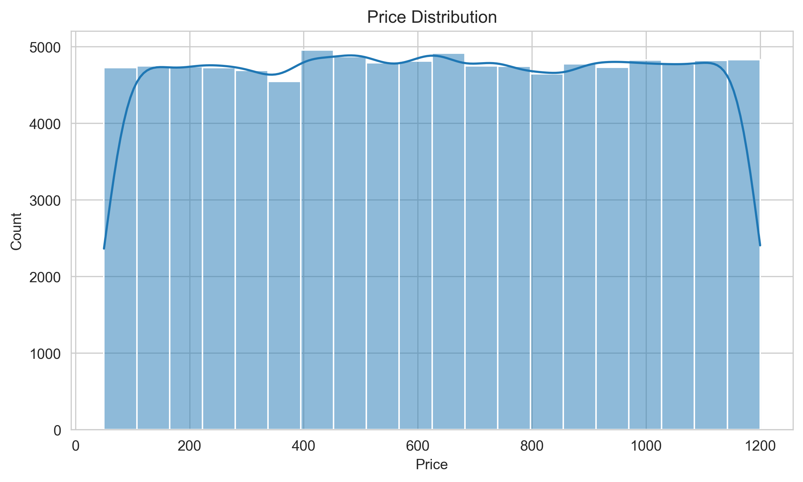
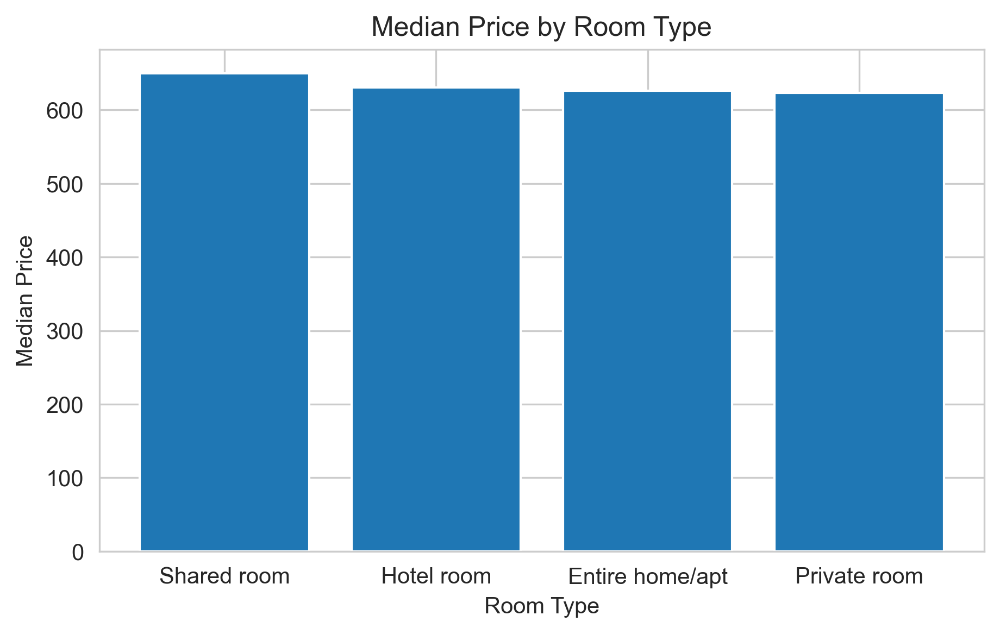
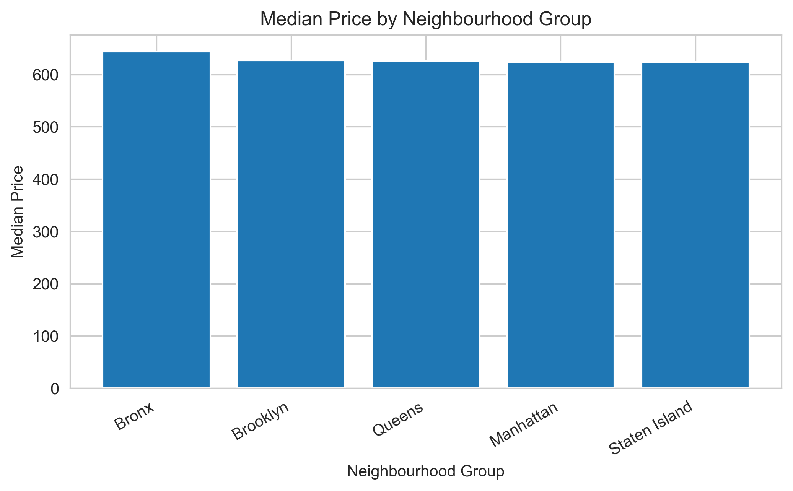
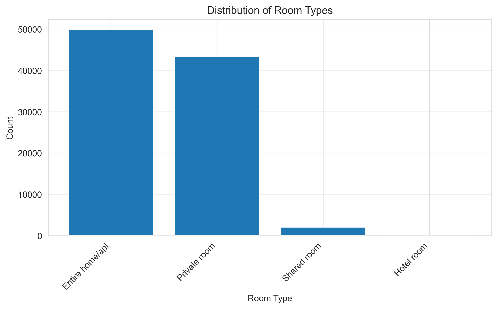
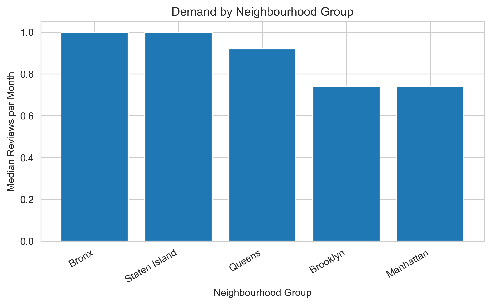
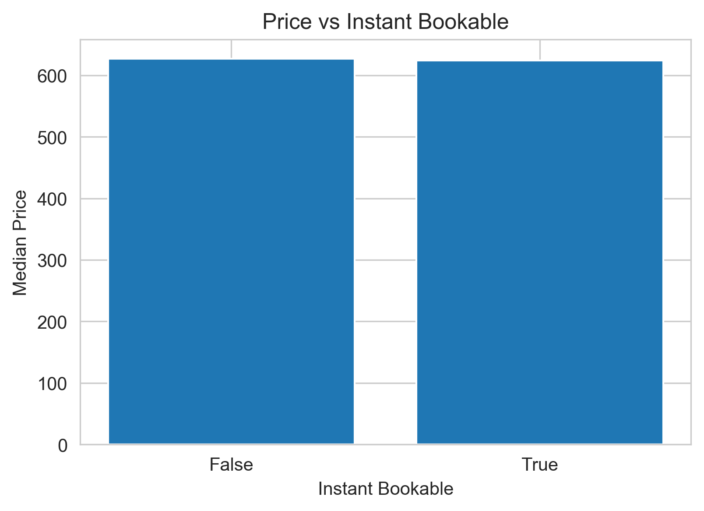
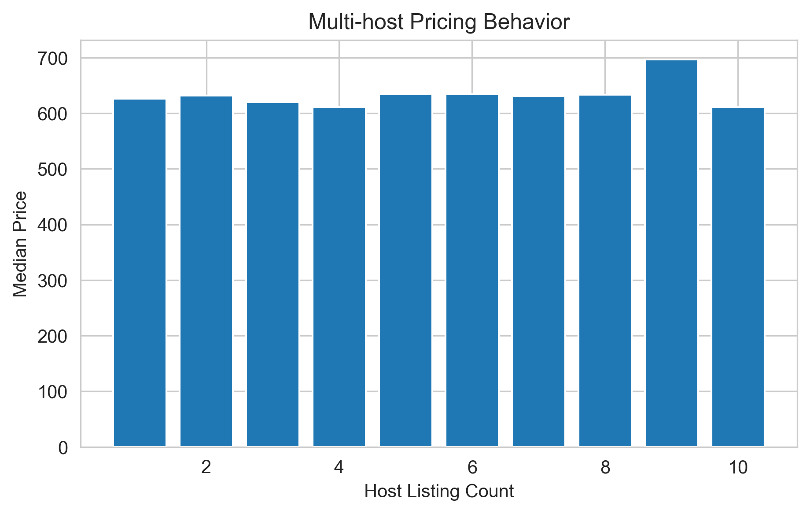
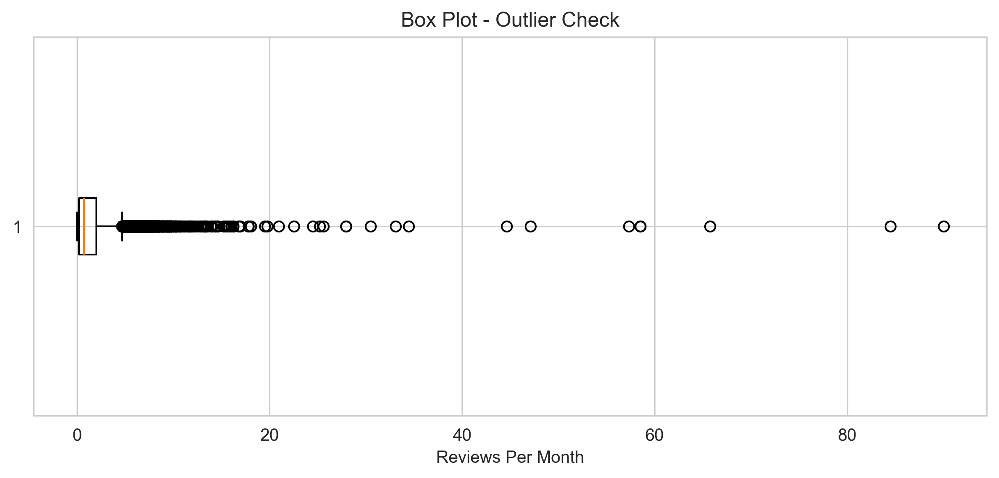

# 📊 Airbnb Open Data Analysis & Data Cleaning

## 📌 Project Overview
This project focuses on **cleaning, exploring, and visualizing** the Airbnb Open Dataset.  
The goal is to demonstrate a **data analyst–oriented workflow**, starting from raw data and ending with clear, interpretable insights supported by visualizations.

Instead of building predictive models, this project emphasizes:
- data cleaning
- exploratory data analysis (EDA)
- effective data visualization

---

## 📁 Dataset
- **Source:** Airbnb Open Data
- **Content:** Airbnb listings with pricing, location, and availability information
- **Main features:**
  - `room type` (Entire home/apt, Private room, Shared room)
  - `price`
  - `neighbourhood group`
  - `minimum nights`
  - `availability 365`
  - `reviews per month`
  - `instant_bookable`
  - `lat` / `long` (geographic coordinates)

---

## 🧹 Data Cleaning Process
The raw dataset contains missing values, inconsistent formats, and invalid data ranges.  
The following cleaning steps were applied:

- Removed duplicate records
- Standardized column names (trim whitespace, lowercase)
- Converted currency-like fields (`price`, `service fee`) to numeric format
- Handled missing values using robust statistics (median imputation)
- Filtered invalid/out-of-range values:
  - `availability 365` outside 0–365
  - `minimum nights` outside 1–365
- Dropped non-essential columns that were not useful for analysis

The focus was on **clarity, reproducibility, and realistic data cleaning decisions**.

---

## 🔍 Exploratory Data Analysis (EDA)
After cleaning, exploratory analysis was performed to understand patterns and trends in the data.

### Key questions explored:
- How is price distributed across different room types?
- Which neighbourhood groups have the highest prices?
- How does availability affect pricing?
- What is the relationship between minimum nights and price?
- Are there geographic patterns in pricing?

---

## 📊 Key Visual Insights

### 💰 Price Distribution


Price distribution shows a right-skewed pattern with most listings concentrated in the lower price range.

---

### 🏠 Median Price by Room Type


Entire homes/apartments command significantly higher median prices compared to private or shared rooms.

---

### 🗺 Median Price by Neighbourhood Group


Certain neighbourhood groups show consistently higher median prices, reflecting location-based demand.

---

### 📈 Room Type Distribution


The majority of listings are entire homes/apartments, followed by private rooms.

---

### � Demand by Neighbourhood


Review counts by neighbourhood reveal which areas have the highest demand and guest activity.

---

### ⚡ Price vs Instant Bookable


Instant bookable listings tend to be priced higher, suggesting a premium for convenience.

---

### � Multi-Host Pricing Behavior


Hosts with multiple listings employ different pricing strategies compared to single-listing hosts.

---

### 📉 Reviews Per Month - Outlier Analysis


Boxplot analysis reveals outliers in review frequency, helping identify highly active listings.

---

## 📈 Key Insights
- **Room type** and **location** have the most significant impact on pricing
- **Instant bookable listings** tend to be priced higher, suggesting a premium for convenience
- Listings with **lower availability** tend to be more expensive, indicating higher demand
- **Central locations** show both higher prices and higher demand (more reviews)
- **Multi-host strategy**: Users with multiple listings employ more competitive pricing strategies
- Price distribution is right-skewed with most listings in the affordable range
- Entire homes/apartments dominate the market and command premium prices

---

## 🛠 Tools & Libraries
- Python
- Pandas
- NumPy
- Matplotlib
- Seaborn
- Jupyter Notebook

---

## 📌 What I Learned
- Cleaning real-world datasets with missing and inconsistent values
- Converting currency strings to numeric data types
- Handling outliers and invalid data ranges
- Structuring an EDA-focused data analysis project
- Communicating insights through clear visualizations
- Working with geographic data (latitude/longitude)

---

## 📂 Repository Structure

```
📦 airbnb-data-analysis
┣ 📁 images
┃ ┣ demand_by_neighbourhood.png
┃ ┣ median_price_by_neighbourhood.png
┃ ┣ median_price_by_room_type.png
┃ ┣ multihost_pricing_behavior.png
┃ ┣ price_distribution_histogram.png
┃ ┣ price_vs_instant_bookable.png
┃ ┣ reviews_per_month_outlier_boxplot.png
┃ ┗ room_type_distribution.png
┣ 📄 notebook.ipynb
┣ 📄 Airbnb_Open_Data.csv
┗ 📄 README.md
```

---

## 🚀 How to Run
1. Open `notebook.ipynb` in VS Code or Jupyter
2. Run cells from top to bottom
3. All visualizations will be generated and saved to the `images` folder